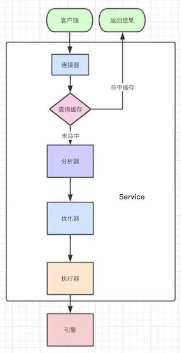
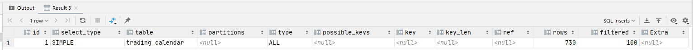
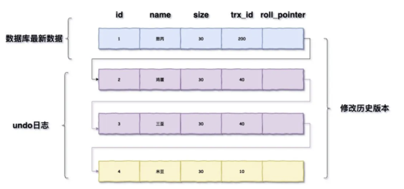
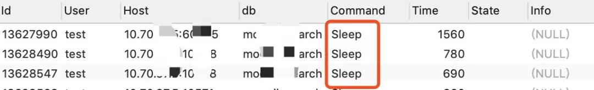

#### mysql的基础架构/MySql的执行流程？


连接器负责跟客户端建立链接、获取权限、维持和管理连接

缓存是以K-V的形式存储的，K是sql，V是结果集，命中就返回缓存的value，如果不命中就执行后面的阶段

可以通过如下命令查询缓存的类型


mysql 8 以上默认关闭，因为缓存命中率太低，因为该table的任意修改都会导致该table所有的缓存失效

mysql 8 以下可以加上SQL NoCache去跑SQL排除缓存影响

而且select * from user和select a.* from user a会被认为是不同的语句

分析器会先做词法分析，你的语句有这么多单词、空格，MySQL就需要识别每个字符串所代表的是什么，是关键字，还是表名，还是列名等等。
   
然后就开始语法分析，根据词法分析的结果，语法分析会判断你sql的对错，错了会提醒你的，并且会提示你哪里错了

优化器有一步就是要确认使用哪个索引，比如使用你的主键索引，联合索引还是什么索引更好

还有就是对执行顺序进行优化，条件那么多，先查哪个表，还是先关联，会出现很多方案，最后由优化器决定选用哪种方案，也即生成执行计划

执行器按照执行计划一条条的调用底层引擎接口查数据

#### 索引可以有哪些数据结构？
哈希表、数组、完全平衡二叉树、B树、B+树都可以

哈希表的特点就是可以快速的精确查询，但是不支持范围查询

有序数组，在等值查询的和范围查询的时候都很Nice，通过二位数组记录按年划分的历史数据，缺点是新增/删除时需要移动数组

完全平衡二叉树是有序的，支持范围查询，时间复杂度是O(log(N))，但索引也不只是在内存里面存储的，还是要落盘持久化的,如果数据多了，树高会很高，查询的成本就会随着树高的增加而增加

B树的表示要比完全平衡二叉树要“矮”，原因在于B树中的一个节点可以存储多个元素。

B+树的表示要比B树要“胖”，原因在于B+树中的非叶子节点会冗余一份在叶子节点中，并且叶子节点之间用指针相连.

最开始的Hash不支持范围查询，二叉树树高很高，只有B树跟B+有的一比。

B树一个节点可以存储多个元素，相对于完全平衡二叉树整体的树高降低了，磁盘IO效率提高了。

而B+树是B树的升级版，只是把非叶子节点冗余一下，这么做的好处是为了提高范围查找的效率。

#### 一个B+树的节点中到底存多少个元素最合适你有了解过么？
因为是按页加载的，所以把一个节点的大小控制在1页、2页、3页、4页等倍数页大小最为合适。

#### 数据库的页结构是怎样的？


各个数据页可以组成一个双向链表

而每个数据页中的记录又可以组成一个单向链表

每个数据页都会为存储在它里边儿的记录生成一个页目录，在通过主键查找某条记录的时候可以在页目录中使用二分法快速定位到对应的槽，然后再遍历该槽对应分组中的记录即可快速找到指定的记录

以其他列(非主键)作为搜索条件：只能从最小记录开始依次遍历单链表中的每条记录。

#### 回表
回表大概就是我们有个主键为ID的索引，和一个普通name字段的索引，我们在普通字段上搜索：
select * from t where name='a';
执行的流程是先查询到name索引上的“a”，然后找到他的id是1，最后去主键索引，找到id为1对应的值。

#### 覆盖索引
接回表的知识点，如果你仅需要查找对应的id,则不需要回表，因为该索引已经可以直接返回了，这种现象叫索引覆盖，本质上是所要查找的东西能不能一次性返回

很多联合索引的建立，就是为了支持覆盖索引，特定的业务能极大的提升效率。

#### 最左匹配原则

* 索引可以简单如一个列 (a)，也可以复杂如多个列 (a,b,c,d)，即联合索引。

* 如果是联合索引，那么key也由多个列组成，同时，索引只能用于查找key是否存在（相等），遇到范围查询 (>、<、between、like左匹配)等就不能进一步匹配了，后续退化为线性查找。

* 因此，列的排列顺序决定了可命中索引的列数。

#### Explain执行计划表都有哪些字段，分别代表什么含义？



#### 执行计划表中，这个统计的行数就是完全对的么？

MySQL中数据的单位都是页，MySQL又采用了采样统计的方法，采样统计的时候，InnoDB默认会选择N个数据页，统计这些页面上的不同值，得到一个平均值，然后乘以这个索引的页面数，就得到了这个索引的基数

如果是上面的统计信息错了，那简单，我们用analyze table tablename 就可以重新统计索引信息了

#### 索引一定会走到最优索引么？

如果走A索引要扫描100行，B所有只要20行，但是他可能选择走A索引，因为优化器在选择的时候发现，走A索引没有额外的代价，比如走B索引并不能直接拿到我们的值，还需要回到主键索引才可以拿到，多了一次回表的过程

一个方法就是force index强制走正确的索引，或者优化SQL，最后实在不行，可以新建索引，或者删掉错误的索引

#### 索引下推是什么？

通常出现在联合索引里面，比如如下查询select * from itemcenter where name like '敖%' and size=22 and age = 20;

语句在搜索索引树的时候，只能用 “敖”，找到第一个满足条件的记录ID1，当然，这还不错，总比全表扫描要好。

然后呢？

当然是判断其他条件是否满足，比如size。

在MySQL 5.6之前，只能从ID1开始一个个回表，到主键索引上找出数据行，再对比字段值。

而MySQL 5.6 引入的索引下推优化（index condition pushdown)， 可以在索引遍历过程中，对索引中包含的字段先做判断，直接过滤掉不满足条件的记录，减少回表次数。

#### 唯一索引普通索引选择难题

核心是需要回答到change buffer


当需要更新一个数据页时，如果数据页在内存中就直接更新，而如果这个数据页还没有在内存中的话，在不影响数据一致性的前提下，InooDB会将这些更新操作缓存在change buffer中，这样就不需要从磁盘中读入这个数据页了。

在下次查询需要访问这个数据页的时候，将数据页读入内存，然后执行change buffer中与这个页有关的操作，通过这种方式就能保证这个数据逻辑的正确性。

对于唯一索引来说，所有的更新操作都要先判断这个操作是否违反唯一性约束。

要判断表中是否存在这个数据，而这必须要将数据页读入内存才能判断，如果都已经读入到内存了，那直接更新内存会更快，就没必要使用change buffer了。

因此，唯一索引的更新就不能使用change buffer，实际上也只有普通索引可以使用。

change buffer用的是buffer pool里的内存，因此不能无限增大，change buffer的大小，可以通过参数innodb_change_buffer_max_size来动态设置，这个参数设置为50的时候，表示change buffer的大小最多只能占用buffer pool的50%

将数据从磁盘读入内存涉及随机IO的访问，是数据库里面成本最高的操作之一，change buffer因为减少了随机磁盘访问，所以对更新性能的提升是会很明显的

change buffer的使用场景-->写多读少，如果你写完后马上读，也即马上触发merge,这样随机访问IO的次数不会减少，反而增加了change buffer的维护代价

#### 前缀索引

因为存在一个磁盘占用的问题，索引选取的越长，占用的磁盘空间就越大，相同的数据页能放下的索引值就越少，搜索的效率也就会越低。我们是否可以建立一个区分度很高的前缀索引，达到优化和节约空间的目的呢？

前缀索引，即使你的联合索引已经包涵了相关信息，他还是会回表，因为他不确定你到底是不是一个完整的信息。

如果存在一个很长的索引，该怎么去优化？

hash或者REVERSE()

#### flush操作

redo log大家都知道，也就是我们对数据库操作的日志，他是在内存中的，每次操作一旦写了redo log就会立马返回结果，但是这个redo log总会找个时间去更新到磁盘，这个操作就是flush。

1. InnoDB的redo log写满了，这时候系统会停止所有更新操作，把checkpoint往前推进，redo log留出空间可以继续写。
   
2. 系统内存不足，当需要新的内存页，而内存不够用的时候，就要淘汰一些数据页，空出内存给别的数据页使用。如果淘汰的是“脏页”，就要先将脏页写到磁盘。

3. MySQL认为系统“空闲”的时候，只要有机会就刷一点“脏页”。

4. MySQL正常关闭，这时候，MySQL会把内存的脏页都flush到磁盘上，这样下次MySQL启动的时候，就可以直接从磁盘上读数据，启动速度会很快。

Innodb刷脏页控制策略，我们每个电脑主机的io能力是不一样的，你要正确地告诉InnoDB所在主机的IO能力，这样InnoDB才能知道需要全力刷脏页的时候，可以刷多快。

这就要用到innodb_io_capacity这个参数了，它会告诉InnoDB你的磁盘能力，这个值建议设置成磁盘的IOPS，磁盘的IOPS可以通过fio这个工具来测试。

正确地设置innodb_io_capacity参数，可以有效的解决这个问题。

这中间有个有意思的点，刷脏页的时候，旁边如果也是脏页，会一起刷掉的，并且如果周围还有脏页，这个连带责任制会一直蔓延，这种情况其实在机械硬盘时代比较好，一次IO就解决了所有问题，

但是现在都是固态硬盘了，innodb_flush_neighbors=0这个参数可以不产生连带制，在MySQL 8.0中，innodb_flush_neighbors参数的默认值已经是0了。

#### 数据库存在几种事务隔离级别

1. 读未提交（READ UNCOMMITTED）：一个事务还没提交时，它做的变更就能被别的事务看到。

2. 读提交（READ COMMITTED）：一个事务提交之后，它做的变更才会被其他事务看到。

3. 可重复读（REPEATABLE READ）：一个事务执行过程中看到的数据，总是跟这个事务在启动时看到的数据是一致的。当然在可重复读隔离级别下，未提交变更对其他事务也是不可见的。

4. 串行化（SERIALIZABLE）：对于同一行记录，“写”会加“写锁”，“读”会加“读锁”，当出现读写锁冲突的时候，后访问的事务必须等前一个事务执行完成，才能继续执行。

SET [GLOBAL|SESSION] TRANSACTION ISOLATION LEVEL level;

显式启动事务语句， begin 或 start transaction，配套的提交语句是commit，回滚语句是rollback。

set autocommit=0，这个命令会将这个线程的自动提交关掉，意味着如果你只执行一个select语句，这个事务就启动了，而且并不会自动提交。这个事务持续存在直到你主动执行commit 或 rollback 语句，或者断开连接。

#### 隔离级别解决了哪些问题

脏读（dirty read）：如果一个事务读到了另一个未提交事务修改过的数据。

不可重复读（non-repeatable read）：如果一个事务只能读到另一个已经提交的事务修改过的数据，并且其他事务每对该数据进行一次修改并提交后，该事务都能查询得到最新值。

幻读（phantom read）：如果一个事务先根据某些条件查询出一些记录，之后另一个事务又向表中插入了符合这些条件的记录，原先的事务再次按照该条件查询时，能把另一个事务插入的记录也读出来。

##### 视图

在MySQL里，有两个“视图”的概念：
     
一个是view，它是一个用查询语句定义的虚拟表，在调用的时候执行查询语句并生成结果。创建视图的语法是create view … ，而它的查询方法与表一样。

另一个是InnoDB在实现MVCC时用到的一致性读视图，即consistent read view，用于支持RC（Read Committed，读提交）和RR（Repeatable Read，可重复读）隔离级别的实现。这个试图其实就是一个事务id.

#### 版本链
这个概念出现在可重复读的事务隔离级别里面，每行数据也都是有多个版本的，每次事务更新数据的时候，都会生成一个新的数据版本，并且把transaction id赋值给这个数据版本的事务ID，记为row trx_id。同时，旧的数据版本要保留，并且在新的数据版本中，能够有信息可以直接拿到它。

也就是说，数据表中的一行记录，其实可能有多个版本(row)，每个版本有自己的row trx_id。

这是一个隐藏列，还有另外一个roll_pointer：每次对某条聚簇索引记录进行改动时，都会把旧的版本写入到undo日志中，然后这个隐藏列就相当于一个指针，可以通过它来找到该记录修改前的信息

undo log的回滚机制也是依靠这个版本链，每次对记录进行改动，都会记录一条undo日志，每条undo日志也都有一个roll_pointer属性（INSERT操作对应的undo日志没有该属性，因为该记录并没有更早的版本），可以将这些undo日志都连起来，串成一个链表，所以现在的情况就像下图一样：



读未提交隔离级别下直接返回记录上的最新值，没有视图概念

在读提交隔离级别下，这个视图是在每个SQL语句开始执行的时候创建的，在这个隔离级别下，事务在每次查询开始时都会生成一个独立的ReadView。

可重复读，在第一次读取数据时生成一个ReadView，对于使用REPEATABLE READ隔离级别的事务来说，只会在第一次执行查询语句时生成一个ReadView，之后的查询就不会重复生成了，所以一个事务的查询结果每次都是一样的。


#### 其他散列知识点

##### 查看数据库连接状态
```mysql
show processlist ;
```


这里需要注意的是，我们数据库的客户端太久没响应，连接器就会自动断开了，这个时间参数是wait_timeout控制住的，默认时长为8小时。

断开后重连的时候会报错，如果你想再继续操作，你就需要重连了。

可以通过长连接去解决，其实长连接是相对于通常的短连接而说的，也就是长时间保持客户端与服务端的连接状态。

通常的短连接操作步骤是：

连接-》数据传输-》关闭连接；

而长连接通常就是：

连接-》数据传输-》保持连接-》数据传输-》保持连接-》…………-》关闭连接；

这就要求长连接在没有数据通信时，定时发送数据包，以维持连接状态，短连接在没有数据传输时直接关闭就行了。

因为链接只有在断开的时候才能可以释放内存资源，如果一直使用长连接，服务端可能会OOM，会导致MySQL重启，客户端可能会频繁的Full GC。
因为每次查询用到的临时内存没有得到释放。可以通过定期断开长连接，或者程序里面判断执行过一个占用内存比较大的查询后就断开连接，需要的时候重连。
其实更推荐在执行一个比较大的查询后，执行mysql_reset_connection可以重新初始化连接资源。这个过程相比上面一种会好点，不需要重连，但是会初始化连接的状态。
