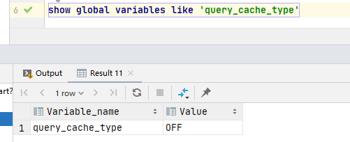

#### mysql的基础架构/MySql的执行流程？


连接器负责跟客户端建立链接、获取权限、维持和管理连接

缓存是以K-V的形式存储的，K是sql，V是结果集，命中就返回缓存的value，如果不命中就执行后面的阶段

可以通过如下命令查询缓存的类型



mysql 8 以上默认关闭，因为缓存命中率太低，因为该table的任意修改都会导致该table所有的缓存失效

而且select * from user和select a.* from user a会被认为是不同的语句

分析器会先做词法分析，你的语句有这么多单词、空格，MySQL就需要识别每个字符串所代表的是什么，是关键字，还是表名，还是列名等等。
   
然后就开始语法分析，根据词法分析的结果，语法分析会判断你sql的对错，错了会提醒你的，并且会提示你哪里错了

优化器有一步就是要确认使用哪个索引，比如使用你的主键索引，联合索引还是什么索引更好

还有就是对执行顺序进行优化，条件那么多，先查哪个表，还是先关联，会出现很多方案，最后由优化器决定选用哪种方案，也即生成执行计划

执行器按照执行计划一条条的调用底层引擎接口查数据

#### 其他散列知识点

##### 查看数据库连接状态
```mysql
show processlist ;
```


这里需要注意的是，我们数据库的客户端太久没响应，连接器就会自动断开了，这个时间参数是wait_timeout控制住的，默认时长为8小时。

断开后重连的时候会报错，如果你想再继续操作，你就需要重连了。

可以通过长连接去解决，其实长连接是相对于通常的短连接而说的，也就是长时间保持客户端与服务端的连接状态。

通常的短连接操作步骤是：

连接-》数据传输-》关闭连接；

而长连接通常就是：

连接-》数据传输-》保持连接-》数据传输-》保持连接-》…………-》关闭连接；

这就要求长连接在没有数据通信时，定时发送数据包，以维持连接状态，短连接在没有数据传输时直接关闭就行了。

因为链接只有在断开的时候才能可以释放内存资源，如果一直使用长连接，服务端可能会OOM，会导致MySQL重启，客户端可能会频繁的Full GC。
因为每次查询用到的临时内存没有得到释放。可以通过定期断开长连接，或者程序里面判断执行过一个占用内存比较大的查询后就断开连接，需要的时候重连。
其实更推荐在执行一个比较大的查询后，执行mysql_reset_connection可以重新初始化连接资源。这个过程相比上面一种会好点，不需要重连，但是会初始化连接的状态。
