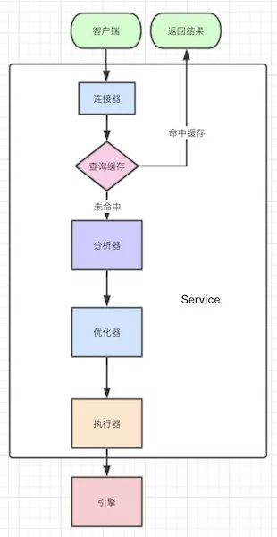
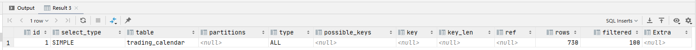
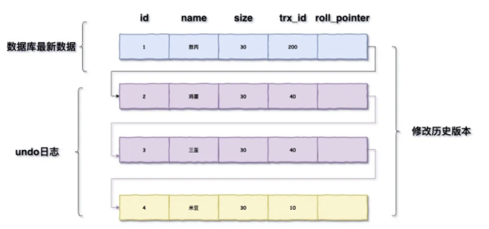
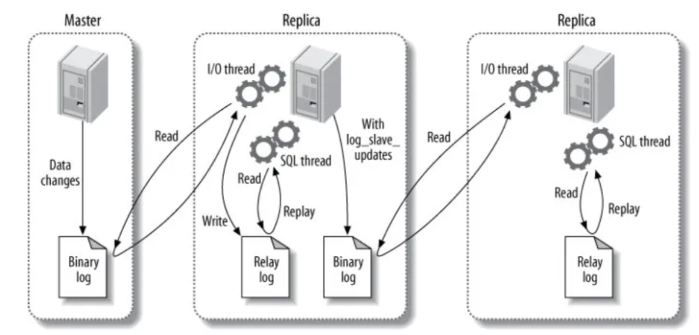
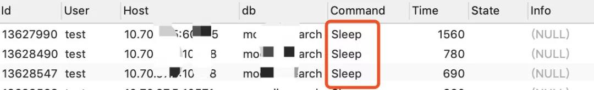

#### mysql的基础架构/MySql的执行流程？


连接器负责跟客户端建立链接、获取权限、维持和管理连接

缓存是以K-V的形式存储的，K是sql，V是结果集，命中就返回缓存的value，如果不命中就执行后面的阶段

可以通过如下命令查询缓存的类型


mysql 8 以上默认关闭，因为缓存命中率太低，因为该table的任意修改都会导致该table所有的缓存失效

mysql 8 以下可以加上SQL NoCache去跑SQL排除缓存影响

而且select * from user和select a.* from user a会被认为是不同的语句

分析器会先做词法分析，你的语句有这么多单词、空格，MySQL就需要识别每个字符串所代表的是什么，是关键字，还是表名，还是列名等等。
   
然后就开始语法分析，根据词法分析的结果，语法分析会判断你sql的对错，错了会提醒你的，并且会提示你哪里错了

优化器有一步就是要确认使用哪个索引，比如使用你的主键索引，联合索引还是什么索引更好

还有就是对执行顺序进行优化，条件那么多，先查哪个表，还是先关联，会出现很多方案，最后由优化器决定选用哪种方案，也即生成执行计划

执行器按照执行计划一条条的调用底层引擎接口查数据

#### 索引可以有哪些数据结构？
哈希表、数组、完全平衡二叉树、B树、B+树都可以

哈希表的特点就是可以快速的精确查询，但是不支持范围查询

有序数组，在等值查询的和范围查询的时候都很Nice，通过二位数组记录按年划分的历史数据，缺点是新增/删除时需要移动数组

完全平衡二叉树是有序的，支持范围查询，时间复杂度是O(log(N))，但索引也不只是在内存里面存储的，还是要落盘持久化的,如果数据多了，树高会很高，查询的成本就会随着树高的增加而增加

B树的表示要比完全平衡二叉树要“矮”，原因在于B树中的一个节点可以存储多个元素。

B+树的表示要比B树要“胖”，原因在于B+树中的非叶子节点会冗余一份在叶子节点中，并且叶子节点之间用指针相连.

最开始的Hash不支持范围查询，二叉树树高很高，只有B树跟B+有的一比。

B树一个节点可以存储多个元素，相对于完全平衡二叉树整体的树高降低了，磁盘IO效率提高了。

而B+树是B树的升级版，只是把非叶子节点冗余一下，这么做的好处是为了提高范围查找的效率。

#### 一个B+树的节点中到底存多少个元素最合适你有了解过么？
因为是按页加载的，所以把一个节点的大小控制在1页、2页、3页、4页等倍数页大小最为合适。

#### 数据库的页结构是怎样的？


各个数据页可以组成一个双向链表

而每个数据页中的记录又可以组成一个单向链表

每个数据页都会为存储在它里边儿的记录生成一个页目录，在通过主键查找某条记录的时候可以在页目录中使用二分法快速定位到对应的槽，然后再遍历该槽对应分组中的记录即可快速找到指定的记录

以其他列(非主键)作为搜索条件：只能从最小记录开始依次遍历单链表中的每条记录。

#### 回表
回表大概就是我们有个主键为ID的索引，和一个普通name字段的索引，我们在普通字段上搜索：
select * from t where name='a';
执行的流程是先查询到name索引上的“a”，然后找到他的id是1，最后去主键索引，找到id为1对应的值。

#### 覆盖索引
接回表的知识点，如果你仅需要查找对应的id,则不需要回表，因为该索引已经可以直接返回了，这种现象叫索引覆盖，本质上是所要查找的东西能不能一次性返回

很多联合索引的建立，就是为了支持覆盖索引，特定的业务能极大的提升效率。

#### 最左匹配原则

* 索引可以简单如一个列 (a)，也可以复杂如多个列 (a,b,c,d)，即联合索引。

* 如果是联合索引，那么key也由多个列组成，同时，索引只能用于查找key是否存在（相等），遇到范围查询 (>、<、between、like左匹配)等就不能进一步匹配了，后续退化为线性查找。

* 因此，列的排列顺序决定了可命中索引的列数。

#### Explain执行计划表都有哪些字段，分别代表什么含义？



#### 执行计划表中，这个统计的行数就是完全对的么？

MySQL中数据的单位都是页，MySQL又采用了采样统计的方法，采样统计的时候，InnoDB默认会选择N个数据页，统计这些页面上的不同值，得到一个平均值，然后乘以这个索引的页面数，就得到了这个索引的基数

如果是上面的统计信息错了，那简单，我们用analyze table tablename 就可以重新统计索引信息了

#### 索引一定会走到最优索引么？

如果走A索引要扫描100行，B所有只要20行，但是他可能选择走A索引，因为优化器在选择的时候发现，走A索引没有额外的代价，比如走B索引并不能直接拿到我们的值，还需要回到主键索引才可以拿到，多了一次回表的过程

一个方法就是force index强制走正确的索引，或者优化SQL，最后实在不行，可以新建索引，或者删掉错误的索引

#### 索引下推是什么？

通常出现在联合索引里面，比如如下查询select * from itemcenter where name like '敖%' and size=22 and age = 20;

语句在搜索索引树的时候，只能用 “敖”，找到第一个满足条件的记录ID1，当然，这还不错，总比全表扫描要好。

然后呢？

当然是判断其他条件是否满足，比如size。

在MySQL 5.6之前，只能从ID1开始一个个回表，到主键索引上找出数据行，再对比字段值。

而MySQL 5.6 引入的索引下推优化（index condition pushdown)， 可以在索引遍历过程中，对索引中包含的字段先做判断，直接过滤掉不满足条件的记录，减少回表次数。

#### 唯一索引普通索引选择难题

核心是需要回答到change buffer


当需要更新一个数据页时，如果数据页在内存中就直接更新，而如果这个数据页还没有在内存中的话，在不影响数据一致性的前提下，InooDB会将这些更新操作缓存在change buffer中，这样就不需要从磁盘中读入这个数据页了。

在下次查询需要访问这个数据页的时候，将数据页读入内存，然后执行change buffer中与这个页有关的操作，通过这种方式就能保证这个数据逻辑的正确性。

对于唯一索引来说，所有的更新操作都要先判断这个操作是否违反唯一性约束。

要判断表中是否存在这个数据，而这必须要将数据页读入内存才能判断，如果都已经读入到内存了，那直接更新内存会更快，就没必要使用change buffer了。

因此，唯一索引的更新就不能使用change buffer，实际上也只有普通索引可以使用。

change buffer用的是buffer pool里的内存，因此不能无限增大，change buffer的大小，可以通过参数innodb_change_buffer_max_size来动态设置，这个参数设置为50的时候，表示change buffer的大小最多只能占用buffer pool的50%

将数据从磁盘读入内存涉及随机IO的访问，是数据库里面成本最高的操作之一，change buffer因为减少了随机磁盘访问，所以对更新性能的提升是会很明显的

change buffer的使用场景-->写多读少，如果你写完后马上读，也即马上触发merge,这样随机访问IO的次数不会减少，反而增加了change buffer的维护代价

#### 前缀索引

因为存在一个磁盘占用的问题，索引选取的越长，占用的磁盘空间就越大，相同的数据页能放下的索引值就越少，搜索的效率也就会越低。我们是否可以建立一个区分度很高的前缀索引，达到优化和节约空间的目的呢？

前缀索引，即使你的联合索引已经包涵了相关信息，他还是会回表，因为他不确定你到底是不是一个完整的信息。

如果存在一个很长的索引，该怎么去优化？

hash或者REVERSE()

#### flush操作

redo log大家都知道，也就是我们对数据库操作的日志，他是在内存中的，每次操作一旦写了redo log就会立马返回结果，但是这个redo log总会找个时间去更新到磁盘，这个操作就是flush。

1. InnoDB的redo log写满了，这时候系统会停止所有更新操作，把checkpoint往前推进，redo log留出空间可以继续写。
   
2. 系统内存不足，当需要新的内存页，而内存不够用的时候，就要淘汰一些数据页，空出内存给别的数据页使用。如果淘汰的是“脏页”，就要先将脏页写到磁盘。

3. MySQL认为系统“空闲”的时候，只要有机会就刷一点“脏页”。

4. MySQL正常关闭，这时候，MySQL会把内存的脏页都flush到磁盘上，这样下次MySQL启动的时候，就可以直接从磁盘上读数据，启动速度会很快。

Innodb刷脏页控制策略，我们每个电脑主机的io能力是不一样的，你要正确地告诉InnoDB所在主机的IO能力，这样InnoDB才能知道需要全力刷脏页的时候，可以刷多快。

这就要用到innodb_io_capacity这个参数了，它会告诉InnoDB你的磁盘能力，这个值建议设置成磁盘的IOPS，磁盘的IOPS可以通过fio这个工具来测试。

正确地设置innodb_io_capacity参数，可以有效的解决这个问题。

这中间有个有意思的点，刷脏页的时候，旁边如果也是脏页，会一起刷掉的，并且如果周围还有脏页，这个连带责任制会一直蔓延，这种情况其实在机械硬盘时代比较好，一次IO就解决了所有问题，

但是现在都是固态硬盘了，innodb_flush_neighbors=0这个参数可以不产生连带制，在MySQL 8.0中，innodb_flush_neighbors参数的默认值已经是0了。

#### 数据库存在几种事务隔离级别

1. 读未提交（READ UNCOMMITTED）：一个事务还没提交时，它做的变更就能被别的事务看到。

2. 读提交（READ COMMITTED）：一个事务提交之后，它做的变更才会被其他事务看到。

3. 可重复读（REPEATABLE READ）：一个事务执行过程中看到的数据，总是跟这个事务在启动时看到的数据是一致的。当然在可重复读隔离级别下，未提交变更对其他事务也是不可见的。

4. 串行化（SERIALIZABLE）：对于同一行记录，“写”会加“写锁”，“读”会加“读锁”，当出现读写锁冲突的时候，后访问的事务必须等前一个事务执行完成，才能继续执行。

SET [GLOBAL|SESSION] TRANSACTION ISOLATION LEVEL level;

显式启动事务语句， begin 或 start transaction，配套的提交语句是commit，回滚语句是rollback。

set autocommit=0，这个命令会将这个线程的自动提交关掉，意味着如果你只执行一个select语句，这个事务就启动了，而且并不会自动提交。这个事务持续存在直到你主动执行commit 或 rollback 语句，或者断开连接。

#### 隔离级别解决了哪些问题

脏读（dirty read）：如果一个事务读到了另一个未提交事务修改过的数据。

不可重复读（non-repeatable read）：如果一个事务只能读到另一个已经提交的事务修改过的数据，并且其他事务每对该数据进行一次修改并提交后，该事务都能查询得到最新值。

幻读（phantom read）：如果一个事务先根据某些条件查询出一些记录，之后另一个事务又向表中插入了符合这些条件的记录，原先的事务再次按照该条件查询时，能把另一个事务插入的记录也读出来。

##### 视图

在MySQL里，有两个“视图”的概念：
     
一个是view，它是一个用查询语句定义的虚拟表，在调用的时候执行查询语句并生成结果。创建视图的语法是create view … ，而它的查询方法与表一样。

另一个是InnoDB在实现MVCC时用到的一致性读视图，即consistent read view，用于支持RC（Read Committed，读提交）和RR（Repeatable Read，可重复读）隔离级别的实现。这个试图其实就是一个事务id.

#### 版本链
这个概念出现在可重复读的事务隔离级别里面，每行数据也都是有多个版本的，每次事务更新数据的时候，都会生成一个新的数据版本，并且把transaction id赋值给这个数据版本的事务ID，记为row trx_id。同时，旧的数据版本要保留，并且在新的数据版本中，能够有信息可以直接拿到它。

也就是说，数据表中的一行记录，其实可能有多个版本(row)，每个版本有自己的row trx_id。

这是一个隐藏列，还有另外一个roll_pointer：每次对某条聚簇索引记录进行改动时，都会把旧的版本写入到undo日志中，然后这个隐藏列就相当于一个指针，可以通过它来找到该记录修改前的信息

undo log的回滚机制也是依靠这个版本链，每次对记录进行改动，都会记录一条undo日志，每条undo日志也都有一个roll_pointer属性（INSERT操作对应的undo日志没有该属性，因为该记录并没有更早的版本），可以将这些undo日志都连起来，串成一个链表，所以现在的情况就像下图一样：



为了保证事务并发操作时，在写各自的undo log时不产生冲突，InnoDB采用回滚段的方式来维护undo log的并发写入和持久化。回滚段实际上是一种 Undo 文件组织方式。

读未提交隔离级别下直接返回记录上的最新值，没有视图概念

在读提交隔离级别下，这个视图是在每个SQL语句开始执行的时候创建的，在这个隔离级别下，事务在每次查询开始时都会生成一个独立的ReadView。

可重复读，在第一次读取数据时生成一个ReadView，对于使用REPEATABLE READ隔离级别的事务来说，只会在第一次执行查询语句时生成一个ReadView，之后的查询就不会重复生成了，所以一个事务的查询结果每次都是一样的。

#### ReadView逻辑

对于 RC(READ COMMITTED) 和 RR(REPEATABLE READ) 隔离级别的实现就是通过上面的版本控制来完成。两种隔离界别下的核心处理逻辑就是判断所有版本中哪个版本是当前事务可见的处理。针对这个问题InnoDB在设计上增加了ReadView的设计，ReadView中主要包含当前系统中还有哪些活跃的读写事务，把它们的事务id放到一个列表中，我们把这个列表命名为为m_ids。

对于查询时的版本链数据是否看见的判断逻辑：

如果被访问版本的 trx_id 属性值小于 m_ids 列表中最小的事务id，表明生成该版本的事务在生成 ReadView 前已经提交，所以该版本可以被当前事务访问。

如果被访问版本的 trx_id 属性值大于 m_ids 列表中最大的事务id，表明生成该版本的事务在生成 ReadView 后才生成，所以该版本不可以被当前事务访问。

如果被访问版本的 trx_id 属性值在 m_ids 列表中最大的事务id和最小事务id之间，那就需要判断一下 trx_id 属性值是不是在 m_ids 列表中，如果在，说明创建 ReadView 时生成该版本的事务还是活跃的，该版本不可以被访问；如果不在，说明创建 ReadView 时生成该版本的事务已经被提交，该版本可以被访问。

#### 从计算机层面开始说一下一个索引数据加载的流程

先说一下磁盘IO，磁盘读取数据靠的是机械运动，每一次读取数据需要寻道、寻点、拷贝到内存三步操作

寻道时间是磁臂移动到指定磁道所需要的时间，一般在5ms以下

寻点是从磁道中找到数据存在的那个点，平均时间是半圈时间，如果是一个7200转/min的磁盘，寻点时间平均是600000/7200/2=4.17ms

拷贝到内存的时间很快，和前面两个时间比起来可以忽略不计，所以一次IO的时间平均是在9ms左右。听起来很快，但数据库百万级别的数据过一遍就达到了9000s，显然就是灾难级别的了。

每一次IO读取的数据我们称之为一页(page)，具体一页有多大数据跟操作系统有关，一般为4k或8k，也就是我们读取一页内的数据时候，实际上才发生了一次IO

也即因为索引的出现让我们减少了磁盘io，所以才会大大的减少了查询时间

#### B树和B+树的区别

B Tree 指的是 Balance Tree，也就是平衡树，平衡树是一颗查找树，并且所有叶子节点位于同一层

B+ Tree 是 B 树的一种变形，它是基于 B Tree 和叶子节点顺序访问指针进行实现，通常用于数据库和操作系统的文件系统中

1. B树的每个节点都会存储数据，而B+树只有叶子节点才会

2. B+树叶子节点间互相有指针

提一嘴其他的树

* AVL树

平衡二叉树，一般是用平衡因子差值决定并通过旋转来实现，左右子树树高差不超过1，那么和红黑树比较它是严格的平衡二叉树，平衡条件非常严格（树高差只有1），只要插入或删除不满足上面的条件就要通过旋转来保持平衡。由于旋转是非常耗费时间的。所以 AVL 树适用于插入/删除次数比较少，但查找多的场景

* 红黑树

通过对从根节点到叶子节点路径上各个节点的颜色进行约束，确保没有一条路径会比其他路径长2倍，因而是近似平衡的。所以相对于严格要求平衡的AVL树来说，它的旋转保持平衡次数较少。适合，查找少，插入/删除次数多的场景。（现在部分场景使用跳表来替换红黑树，可搜索“为啥 redis 使用跳表(skiplist)而不是使用 red-black？”）

* B/B+ 树

多路查找树，出度高，磁盘IO低，一般用于数据库系统中。

#### 哈希索引

InnoDB 存储引擎有一个特殊的功能叫“自适应哈希索引”，当某个索引值被使用的非常频繁时，会在 B+Tree 索引之上再创建一个哈希索引，这样就让 B+Tree 索引具有哈希索引的一些优点，比如快速的哈希查找。

#### 全文索引

InnoDB和MyISAM都支持

#### 空间数据索引

MyISAM的概念

#### B+树存储10亿数据需要几层树的高度

nnoDB存储引擎中页的大小为16KB，一般表的主键类型为INT（占用4个字节）或BIGINT（占用8个字节），指针类型也一般为4或8个字节，也就是说一个页（B+Tree中的一个节点）中大概存储16KB/(8B+8B)=1K个键值（因为是估值，为方便计算，这里的K取值为〖10〗^3）。

也就是说一个深度为3的B+Tree索引可以维护10^3 * 10^3 * 10^3 = 10亿 条记录。（这种计算方式存在误差，而且没有计算叶子节点，如果计算叶子节点其实是深度为4了）

#### InnoDB和MyISAM的区别

1. InnoDB 是 MySQL 默认的事务型存储引擎，MyISAM不是

2. InnoDB 采用 MVCC 来支持高并发，并且实现了四个标准隔离级别(未提交读、提交读、可重复读、可串行化)。其默认级别时可重复读（REPEATABLE READ），在可重复读级别下，通过 MVCC + Next-Key Locking 防止幻读。MyIASM不支持行级锁，只能对整张表加锁，读取时会对需要读到的所有表加共享锁，写入时则对表加排它锁。但在表有读取操作的同时，也可以往表中插入新的记录，这被称为并发插入（CONCURRENT INSERT）。

3. InnoDB 支持外键

4. InnoDB 支持在线热备份

5. MyISAM 崩溃后发生损坏的概率比 InnoDB 高很多，而且恢复的速度也更慢。

6. MyISAM 支持压缩表和空间数据索引

#### explain返回值如何看
* select_type 常用的有 SIMPLE 简单查询，UNION 联合查询，SUBQUERY 子查询等
* table 要查询的表
* possible_keys 可选择的索引
* key 实际使用的索引
* rows 扫描的行数
* type 索引查询类型
    * system 触发条件：表只有一行，这是一个 const type 的特殊情况
    * const 触发条件：在使用主键或者唯一索引进行查询的时候只有一行匹配
    * eq_ref 触发条件：在进行联接查询的，使用主键或者唯一索引并且只匹配到一行记录的时候
    * ref 触发条件：使用非唯一索引
    * range 触发条件：只有在使用主键、单个字段的辅助索引、多个字段的辅助索引的最后一个字段进行范围查询才是 range
    * index 触发条件：只扫描索引树 1）查询的字段是索引的一部分，覆盖索引。2）使用主键进行排序
    * all 触发条件：全表扫描，不走索引
    
#### 切分大查询
一个大查询如果一次性执行的话，可能一次锁住很多数据、占满整个事务日志、耗尽系统资源、阻塞很多小的但重要的查询

```sql
DELETE FROM messages WHERE create < DATE_SUB(NOW(), INTERVAL 3 MONTH);
```
```mysql
rows_affected = 0
do {
    rows_affected = do_query(
    "DELETE FROM messages WHERE create  < DATE_SUB(NOW(), INTERVAL 3 MONTH) LIMIT 10000")
} while rows_affected > 0
```

#### 分解大连接查询
将一个大连接查询分解成对每一个表进行一次单表查询，然后在应用程序中进行关联，这样做的好处有：

* 让缓存更高效。对于连接查询，如果其中一个表发生变化，那么整个查询缓存就无法使用。而分解后的多个查询，即使其中一个表发生变化，对其它表的查询缓存依然可以使用。
* 分解成多个单表查询，这些单表查询的缓存结果更可能被其它查询使用到，从而减少冗余记录的查询。
* 减少锁竞争；
* 在应用层进行连接，可以更容易对数据库进行拆分，从而更容易做到高性能和可伸缩。
* 查询本身效率也可能会有所提升。例如下面的例子中，使用 IN() 代替连接查询，可以让 MySQL 按照 ID 顺序进行查询，这可能比随机的连接要更高效。


#### 事务

* Atomicity：原子性，事务被视为不可分割的最小单元，事务的所有操作要么全部成功，要么全部失败回滚。
* Consistency：一致性，数据库在事务执行前后都保持一致性状态，在一致性状态下，所有事务对一个数据的读取结果都是相同的。
* Isolation：隔离性，一个事务所做的修改在最终提交以前，对其他事务是不可见的。
* Durability：持久性，一旦事务提交，则其所做的修改将会永远保存到数据库中。即使系统发生崩溃，事务执行的结果也不能丢。

#### 锁
* 共享锁（S Lock） 允许事务读一行数据
* 排他锁（X Lock） 允许事务删除或者更新一行数据
* 意向共享锁（IS Lock） 事务想要获得一张表中某几行的共享锁
* 意向排他锁（IX Lock） 事务想要获得一张表中某几行的排他锁

#### 锁算法
在 InnoDB 存储引擎中，SELECT 操作的不可重复读问题通过 MVCC 得到了解决，而 UPDATE、DELETE 的不可重复读问题通过 Record Lock 解决，INSERT 的不可重复读问题是通过 Next-Key Lock（Record Lock + Gap Lock）解决的。
##### Record Lock
锁定一个记录上的索引，而不是记录本身。
如果表没有设置索引，InnoDB 会自动在主键上创建隐藏的聚簇索引，因此 Record Locks 依然可以使用。
##### Gap Lock
锁定索引之间的间隙，但是不包含索引本身。例如当一个事务执行以下语句，其它事务就不能在 t.c 中插入 15。
##### Next-Key Lock
它是 Record Locks 和 Gap Locks 的结合，不仅锁定一个记录上的索引，也锁定索引之间的间隙。例如一个索引包含以下值：10, 11, 13, and 20，那么就需要锁定以下区间：


#### 快照读和当前读
```sql
- select * from table where ? lock in share mode;
- select * from table where ? for update;
```

#### 分库分表数据切分
水平切分又称为 Sharding，它是将同一个表中的记录拆分到多个结构相同的表中。
垂直切分是将一张表按列分成多个表，通常是按照列的关系密集程度进行切分，也可以利用垂直气氛将经常被使用的列喝不经常被使用的列切分到不同的表中。
Sharding 策略
哈希取模：hash(key)%N
范围：可以是 ID 范围也可以是时间范围
映射表：使用单独的一个数据库来存储映射关系
Sharding 存在的问题
事务问题
使用分布式事务来解决，比如 XA 接口
连接
可以将原来的连接分解成多个单表查询，然后在用户程序中进行连接。
唯一性
使用全局唯一 ID （GUID）
为每个分片指定一个 ID 范围
分布式 ID 生成器（如 Twitter 的 Snowflake 算法）

#### 复制
##### 主从复制
主要涉及三个线程：binlog 线程、I/O 线程和 SQL 线程。
binlog 线程 ：负责将主服务器上的数据更改写入二进制日志（Binary log）中。
I/O 线程 ：负责从主服务器上读取- 二进制日志，并写入从服务器的中继日志（Relay log）。
SQL 线程 ：负责读取中继日志，解析出主服务器已经执行的数据更改并在从服务器中重放（Replay）。


##### 读写分离
主服务器处理写操作以及实时性要求比较高的读操作，而从服务器处理读操作
读写分离能提高性能的原因在于：
主从服务器负责各自的读和写，极大程度缓解了锁的争用；
从服务器可以使用 MyISAM，提升查询性能以及节约系统开销；
增加冗余，提高可用性。
读写分离常用代理方式来实现，代理服务器接收应用层传来的读写请求，然后决定转发到哪个服务器。

#### json


#### 其他散列知识点

##### 查看数据库连接状态
```mysql
show processlist ;
```


这里需要注意的是，我们数据库的客户端太久没响应，连接器就会自动断开了，这个时间参数是wait_timeout控制住的，默认时长为8小时。

断开后重连的时候会报错，如果你想再继续操作，你就需要重连了。

可以通过长连接去解决，其实长连接是相对于通常的短连接而说的，也就是长时间保持客户端与服务端的连接状态。

通常的短连接操作步骤是：

连接-》数据传输-》关闭连接；

而长连接通常就是：

连接-》数据传输-》保持连接-》数据传输-》保持连接-》…………-》关闭连接；

这就要求长连接在没有数据通信时，定时发送数据包，以维持连接状态，短连接在没有数据传输时直接关闭就行了。

因为链接只有在断开的时候才能可以释放内存资源，如果一直使用长连接，服务端可能会OOM，会导致MySQL重启，客户端可能会频繁的Full GC。
因为每次查询用到的临时内存没有得到释放。可以通过定期断开长连接，或者程序里面判断执行过一个占用内存比较大的查询后就断开连接，需要的时候重连。
其实更推荐在执行一个比较大的查询后，执行mysql_reset_connection可以重新初始化连接资源。这个过程相比上面一种会好点，不需要重连，但是会初始化连接的状态。
