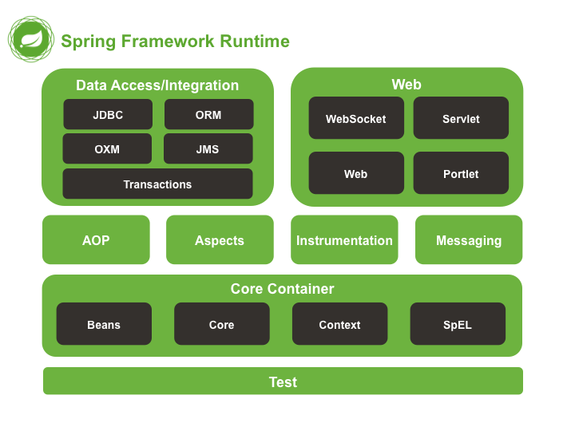

#### 挖坑，不填我是🐕

##### 什么是Spring框架?
一般说 Spring 框架指的都是 Spring Framework，它是很多模块的集合，使用这些模块可以很方便地协助我们进行开发。

这些模块是：核心容器、数据访问/集成,、Web、AOP（面向切面编程）、工具、消息和测试模块。

比如：Core Container 中的 Core 组件是Spring 所有组件的核心，Beans 组件和 Context 组件是实现IOC和依赖注入的基础，AOP组件用来实现面向切面编程

核心技术 ：依赖注入(DI)，AOP，事件(events)，资源，i18n，验证，数据绑定，类型转换，SpEL。

测试 ：模拟对象，TestContext框架，Spring MVC 测试，WebTestClient。

数据访问 ：事务，DAO支持，JDBC，ORM，编组XML。

Web支持 : Spring MVC和Spring WebFlux Web框架。

集成 ：远程处理，JMS，JCA，JMX，电子邮件，任务，调度，缓存。

语言 ：Kotlin，Groovy，动态语言。

##### 列举一些重要的Spring模块？

* Spring Core： 基础,可以说 Spring 其他所有的功能都需要依赖于该类库。主要提供 IoC 依赖注入功能。
* Spring Aspects ：该模块为与AspectJ的集成提供支持。
* Spring AOP ：提供了面向切面的编程实现。
* Spring JDBC : Java数据库连接。
* Spring JMS ：Java消息服务。
* Spring ORM : 用于支持Hibernate等ORM工具。
* Spring Web : 为创建Web应用程序提供支持。
* Spring Test : 提供了对 JUnit 和 TestNG 测试的支持。

##### 谈谈自己对于 Spring IoC 和 AOP 的理解

* <a>https://www.zhihu.com/question/23277575/answer/169698662</a>
* <a>https://javadoop.com/post/spring-ioc</a>

AOP(Aspect-Oriented Programming:面向切面编程)能够将那些与业务无关，却为业务模块所共同调用的逻辑或责任（例如事务处理、日志管理、权限控制等）封装起来，便于减少系统的重复代码，降低模块间的耦合度

* 静态代理
* 动态代理
  * jdk动态代理
  * cglib动态代理

##### Spring AOP 和 AspectJ AOP 有什么区别
Spring AOP 属于运行时增强，而 AspectJ 是编译时增强。 Spring AOP 基于代理(Proxying)，而 AspectJ 基于字节码操作(Bytecode Manipulation)。
Spring AOP 已经集成了 AspectJ ，AspectJ 应该算的上是 Java 生态系统中最完整的 AOP 框架了。AspectJ 相比于 Spring AOP 功能更加强大，但是 Spring AOP 相对来说更简单，

如果我们的切面比较少，那么两者性能差异不大。但是，当切面太多的话，最好选择 AspectJ ，它比Spring AOP 快很多。

##### Spring 中的 bean 的作用域有哪些?
* singleton : 唯一 bean 实例，Spring 中的 bean 默认都是单例的。
* prototype : 每次请求都会创建一个新的 bean 实例。
* request : 每一次HTTP请求都会产生一个新的bean，该bean仅在当前HTTP request内有效。
* session : 每一次HTTP请求都会产生一个新的 bean，该bean仅在当前 HTTP session 内有效。
* global-session：全局session作用域，仅仅在基于portlet的web应用中才有意义，Spring5已经没有了。Portlet是能够生成语义代码(例如：HTML)片段的小型Java Web插件。它们基于portlet容器，可以像servlet一样处理HTTP请求。但是，与 servlet 不同，每个 portlet 都有不同的会话

##### Spring 中的单例 bean 的线程安全问题了解吗？
单例 bean 存在线程问题，主要是因为当多个线程操作同一个对象的时候，对这个对象的非静态成员变量的写操作会存在线程安全问题，即是是静态对象，但由于i++这种非原子性操作依然会带来线程安全问题

可以通过在类中定义一个ThreadLocal成员变量，将需要的可变成员变量保存在 ThreadLocal 中（推荐的一种方式）。

##### Spring 中的 bean 生命周期?
* https://yemengying.com/2016/07/14/spring-bean-life-cycle/
* https://www.cnblogs.com/zrtqsk/p/3735273.html

##### SpringMVC 工作原理了解吗?

##### Spring 框架中用到了哪些设计模式？
https://mp.weixin.qq.com/s/-p-syLd3TZoyhAyYS0wUxQ

##### @Component 和 @Bean 的区别是什么？

##### Spring 管理事务的方式有几种？
* 编程式事务
* 声明式事务
    * xml版
    * 注解版
    
##### Spring 事务中的隔离级别有哪几种?

##### Spring 事务中哪几种事务传播行为?

